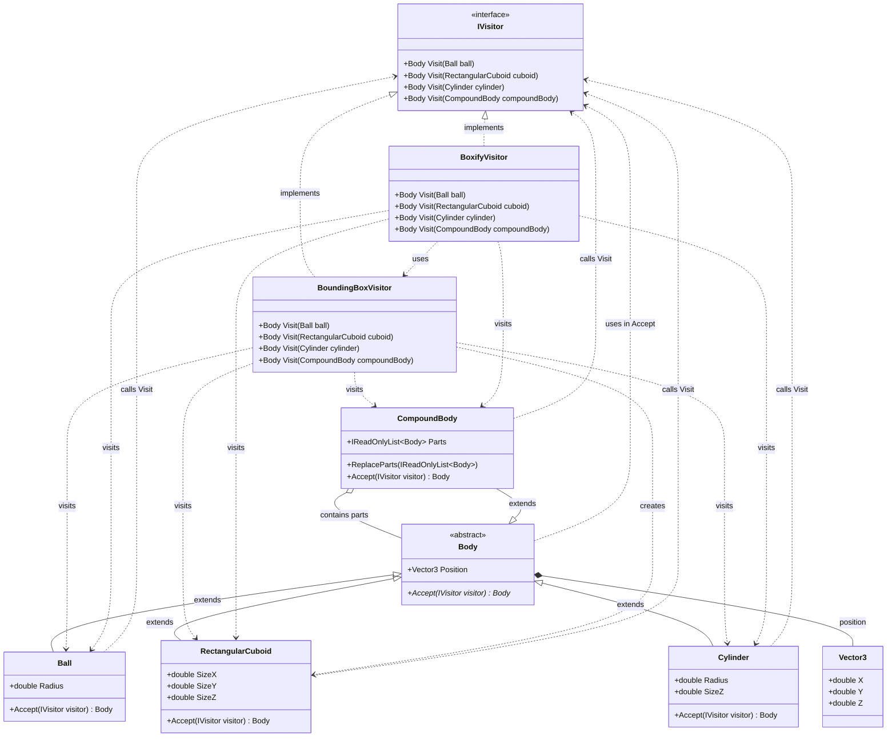

# Практика: Geometry 2

## 1. Описание предметной области и сущностей
Система реализует паттерн Visitor для выполнения операций над геометрическими телами без модификации их классов. 
Основные сущности — абстрактный класс Body и его наследники (Ball, RectangularCuboid, Cylinder, CompoundBody), представляющие различные геометрические фигуры в трехмерном пространстве. Интерфейс IVisitor определяет методы для обработки каждой фигуры, а конкретные посетители (BoundingBoxVisitor и BoxifyVisitor) реализуют различные операции: вычисление ограничивающего параллелепипеда и замену фигур на их упрощенные прямоугольные представления соответственно.
Класс Body содержит свойство Position и абстрактный метод Accept для реализации двойной диспетчеризации. Каждая конкретная фигура переопределяет Accept, вызывая соответствующий метод Visit у посетителя.

## 2. Диаграмма классов (Mermaid)

