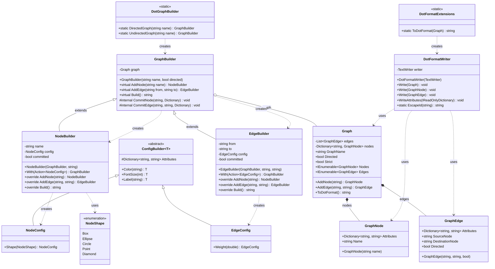

# Практика: GraphViz

## 1. Описание предметной области и сущностей
Система предназначена для построения графов в формате DOT (Graphviz) с использованием Fluent API - паттерна, позволяющего создавать объекты через цепочку вызовов методов, читаемую как естественный язык.
Точка входа - статический класс DotGraphBuilder, предоставляющий фабричные методы DirectedGraph() и UndirectedGraph() для создания направленных и ненаправленных графов.
Основной конструктор/строитель - GraphBuilder, который хранит ссылку на объект Graph и предоставляет методы AddNode(), AddEdge() и Build(). Методы AddNode() и AddEdge() возвращают специализированные билдеры (NodeBuilder и EdgeBuilder), которые наследуются от GraphBuilder, что позволяет продолжать цепочку вызовов без дублирования кода.
Паттерн Builder с конфигурацией: методы .With() принимают лямбда-выражения, настраивающие атрибуты через объекты NodeConfig и EdgeConfig. Эти конфигурационные классы наследуются от абстрактного ConfigBuilder, в котором реализованы общие атрибуты (Color, FontSize, Label). Специфичные атрибуты (Shape для узлов, Weight для рёбер) добавлены в дочерних классах.
Ключевая особенность Fluent API: метод .With() возвращает базовый тип GraphBuilder, у которого нет метода .With(), что предотвращает повторный вызов конфигурации для того же узла/ребра и обеспечивает типобезопасность цепочки.
Доменная модель (Graph, GraphNode, GraphEdge) отделена от API-слоя. Форматирование в DOT-строку делегировано классу DotFormatWriter, который корректно экранирует идентификаторы согласно спецификации Graphviz.

## 2. Диаграмма классов (Mermaid)

