# Практика: Fractal Painter. DIP

## 1. Описание предметной области и сущностей
Приложение для рисования фракталов (кривая Коха, дракон) с настраиваемыми параметрами изображения и палитрой цветов.
Ключевые сущности и их ответственность:

    Интерфейс IUiAction - абстракция для действий меню приложения. Каждое действие имеет категорию, имя, возможность выполнения и метод выполнения. Позволяет добавлять новые действия без изменения кода меню.
    Классы действий (ImageSettingsAction, SaveImageAction, PaletteSettingsAction, DragonFractalAction, KochFractalAction) - конкретные реализации действий меню. После рефакторинга принимают зависимости через конструктор (Dependency Injection), что устраняет прямую зависимость от сервис-локатора Services.
    MainWindow - главное окно приложения, координирует создание действий и инициализацию UI. Содержит меню и контрол изображения.
    IImageController / AvaloniaImageController - абстракция и реализация контроллера изображений. Отвечает за создание, сохранение и отображение изображений фракталов.
    SettingsManager - управляет загрузкой и сохранением настроек приложения. Использует IObjectSerializer для сериализации и IBlobStorage для хранения.
    ImageSettings, Palette, DragonSettings - объекты настроек. ImageSettings определяет размер и фон изображения, Palette - цвета для рисования, DragonSettings — параметры фрактала дракона.
    KochPainter, DragonPainter - рисовальщики фракталов. Принимают IImageController и Palette через конструктор для рисования.
    Services - сервис-локатор (устаревший подход). После рефакторинга его использование должно быть ограничено только точкой входа (MainWindow), а зависимости передаваться через конструкторы.

## 2. Диаграмма классов (Mermaid)

```mermaid
classDiagram
    %% Интерфейсы 
    class IUiAction {
        <<interface>>
        +MenuCategory Category
        +string Name
        +bool CanExecute(object parameter)
        +void Execute(object parameter)
        +event EventHandler CanExecuteChanged
    }

    class IImageController {
        <<interface>>
        +void RecreateImage(ImageSettings settings)
        +void SaveImage(string path)
        +DrawingContext CreateDrawingContext()
        +Size GetImageSize()
        +void UpdateUi()
    }

    class IObjectSerializer {
        <<interface>>
        +string Serialize(object obj)
        +T Deserialize~T~(byte[] data)
    }

    class IBlobStorage {
        <<interface>>
        +byte[] Get(string key)
        +void Set(string key, byte[] data)
    }

    class IImageSettingsProvider {
        <<interface>>
        +ImageSettings ImageSettings
    }

    %% Классы действий 
    class ImageSettingsAction {
        -IImageController imageController
        -ImageSettings imageSettings
        -Func~Window~ mainWindowFactory
        +ImageSettingsAction(IImageController, ImageSettings, Func~Window~)
        +MenuCategory Category
        +string Name
        +void Execute(object parameter)
    }

    class SaveImageAction {
        -IImageController imageController
        -Func~Window~ mainWindowFactory
        +SaveImageAction(IImageController, Func~Window~)
        +MenuCategory Category
        +string Name
        +void Execute(object parameter)
    }

    class PaletteSettingsAction {
        -Palette palette
        -Func~Window~ mainWindowFactory
        +PaletteSettingsAction(Palette, Func~Window~)
        +MenuCategory Category
        +string Name
        +void Execute(object parameter)
    }

    class DragonFractalAction {
        +MenuCategory Category
        +string Name
        +void Execute(object parameter)
    }

    class KochFractalAction {
        +MenuCategory Category
        +string Name
        +void Execute(object parameter)
    }

    %% UI компоненты 
    class MainWindow {
        -Menu menu
        -ImageControl image
        +MainWindow()
        +MainWindow(IUiAction[], AvaloniaImageController)
    }

    class SettingsForm {
        +SettingsForm(object settings)
        +Task ShowDialog(Window parent)
    }

    class ImageControl {
        +void SetImage(Bitmap bitmap)
    }

    class AvaloniaImageController {
        -ImageControl control
        -ImageSettings settings
        +void SetControl(ImageControl control)
        +void RecreateImage(ImageSettings settings)
        +void SaveImage(string path)
        +DrawingContext CreateDrawingContext()
        +Size GetImageSize()
        +void UpdateUi()
    }

    %% Настройки 
    class ImageSettings {
        +int Width
        +int Height
        +Color BackgroundColor
    }

    class Palette {
        +Color BackgroundColor
        +Color PrimaryColor
        +Color SecondaryColor
    }

    class AppSettings {
        +ImageSettings ImageSettings
    }

    class DragonSettings {
        +double Angle1
        +double Angle2
        +float ShiftX
        +float ShiftY
        +float Scale
        +int IterationsCount
    }

    %% Менеджеры и сервисы 
    class SettingsManager {
        -IObjectSerializer serializer
        -IBlobStorage storage
        -string settingsFilename
        +SettingsManager(IObjectSerializer, IBlobStorage)
        +AppSettings Load()
        +void Save(AppSettings settings)
    }

    class Services {
        <<static>>
        +static ImageSettings GetImageSettings()
        +static Palette GetPalette()
        +static IImageController GetImageController()
        +static Window GetMainWindow()
        +static void SetMainWindow(Window window)
    }

    %% Рисовальщики 
    class KochPainter {
        -IImageController imageController
        -Palette palette
        +KochPainter(IImageController, Palette)
        +void Paint()
    }

    class DragonPainter {
        -IImageController imageController
        -Palette palette
        -DragonSettings settings
        +DragonPainter(IImageController, Palette, DragonSettings)
        +void Paint()
    }

    class DragonSettingsGenerator {
        -Random random
        +DragonSettingsGenerator(Random)
        +DragonSettings Generate()
    }

    %% Перечисления
    class MenuCategory {
        <<enumeration>>
        File
        Settings
        Fractals
    }

    %% Связи

    %% Реализация интерфейсов (<|..)
    IUiAction <|.. ImageSettingsAction
    IUiAction <|.. SaveImageAction
    IUiAction <|.. PaletteSettingsAction
    IUiAction <|.. DragonFractalAction
    IUiAction <|.. KochFractalAction
    IImageController <|.. AvaloniaImageController

    %% Агрегация (o--) 
    SettingsManager o-- IObjectSerializer : serializer
    SettingsManager o-- IBlobStorage : storage
    AppSettings o-- ImageSettings : ImageSettings
    MainWindow o-- ImageControl : image
    MainWindow o-- Menu : menu
    AvaloniaImageController o-- ImageControl : control
    KochPainter o-- IImageController : imageController
    KochPainter o-- Palette : palette
    DragonPainter o-- IImageController : imageController
    DragonPainter o-- Palette : palette
    DragonPainter o-- DragonSettings : settings
    ImageSettingsAction o-- IImageController : imageController
    ImageSettingsAction o-- ImageSettings : imageSettings
    SaveImageAction o-- IImageController : imageController
    PaletteSettingsAction o-- Palette : palette

    %% Ассоциация (-->) 
    ImageSettingsAction --> Func~Window~ : mainWindowFactory
    SaveImageAction --> Func~Window~ : mainWindowFactory
    PaletteSettingsAction --> Func~Window~ : mainWindowFactory
    DragonSettingsGenerator --> Random : random

    %% Зависимость (..>) 
    ImageSettingsAction ..> SettingsForm : creates
    SaveImageAction ..> TopLevel : uses
    PaletteSettingsAction ..> SettingsForm : creates
    MainWindow ..> Services : uses (до рефакторинга)
    MainWindow ..> SettingsManager : creates
    SettingsManager ..> AppSettings : creates
    DragonSettingsGenerator ..> DragonSettings : creates
```

