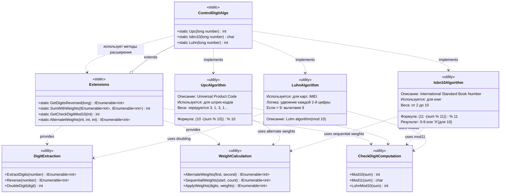

# Практика: Контрольный разряд

## 1. Описание предметной области и сущностей
Система вычисления контрольных разрядов для различных стандартов нумерации (UPC, ISBN-10, алгоритм Луна). Контрольный разряд - это дополнительная цифра, вычисляемая по остальным цифрам номера, которая используется для автоматического обнаружения ошибок при ручном вводе или считывании номеров сканерами.
Сущности:

    ControlDigitAlgo - главный класс, предоставляющий публичный API для расчёта контрольных цифр по трём алгоритмам:
        Upc() - для штрих-кодов товаров (Universal Product Code)
        Isbn10() - для книжных номеров (International Standard Book Number)
        Luhn() - для банковских карт, IMEI и других идентификаторов
    Extensions - класс методов расширений, инкапсулирующий общую вспомогательную логику:
        GetDigitsReversed() - извлечение цифр из числа справа налево
        SumWithWeights() - суммирование цифр с применением весовых коэффициентов
        GetCheckDigitMod10() - вычисление контрольной цифры по модулю 10
        AlternateWeights() - генерация чередующихся весов (3,1,3,1...)

Класс ControlDigitAlgo делегирует повторяющиеся операции методам из Extensions, что позволяет избежать дублирования кода и упрощает тестирование. Каждый алгоритм использует специфичные веса и формулы, но опирается на общие примитивы для извлечения цифр и вычисления контрольного разряда.

## 2. Диаграмма классов (Mermaid)

