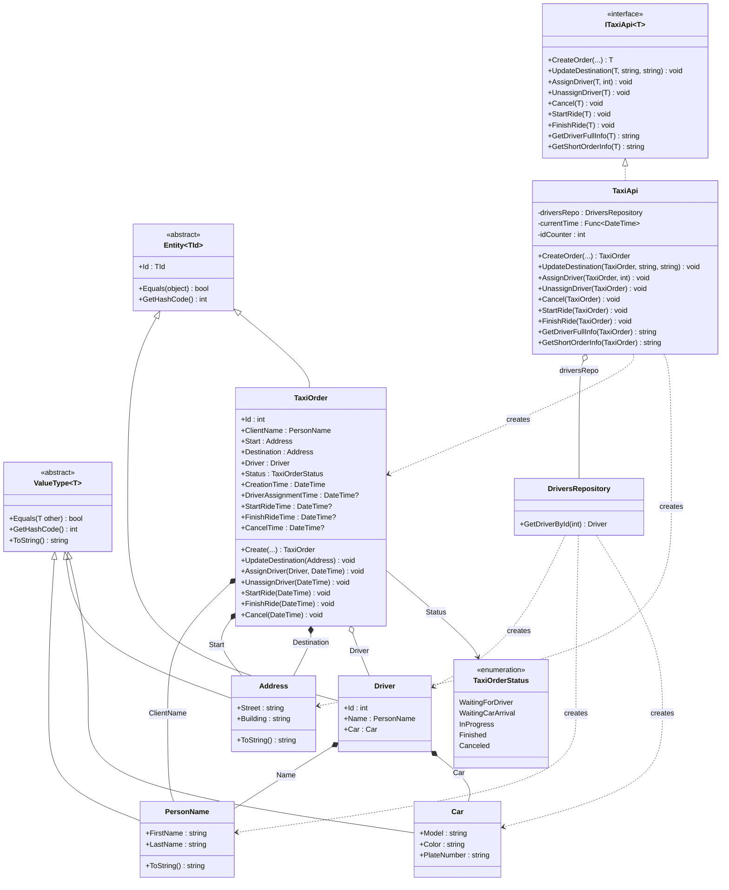

# Практика: TaxiOrder

## 1. Описание предметной области и сущностей
Система автоматизирует обработку заявок в службе такси, управляя жизненным циклом заказа от момента создания до завершения поездки.
Архитектурный подход: Решение построено на принципах предметно-ориентированного проектирования (DDD), где бизнес-логика инкапсулирована в доменных моделях, а техническая 
Компоненты:

    Базовые абстракции (Entity<TKey>, ValueType<T>) - обеспечивают общую функциональность для сущностей и объектов-значений, реализуя семантику сравнения и идентичности.
    Объекты-значения (PersonName, Address, Car) - неизменяемые объекты, определяемые своими атрибутами, а не идентичностью. Сравниваются по значению всех полей.
    Сущности (Driver, TaxiOrder) - объекты с уникальной идентичностью (Id), которые проходят через различные состояния в процессе жизненного цикла.
    Агрегат TaxiOrder - корневая сущность, инкапсулирующая правила перехода между статусами заказа и обеспечивающая согласованность данных.
    Сервисный слой (TaxiApi) - координирует взаимодействие между компонентами, делегируя бизнес-правила доменным объектам.
    Репозиторий (DriversRepository) - абстрагирует доступ к данным о водителях, предоставляя интерфейс для поиска по идентификатору.

## 2. Диаграмма классов (Mermaid)

